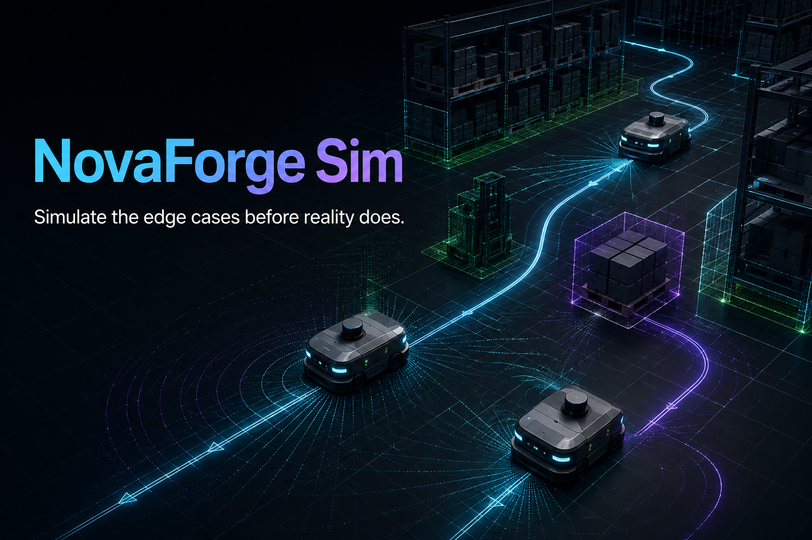

<div align="center">
  
  <h1>NovaForge Sim</h1>
  <p><strong>Simulate the edge cases before reality does.</strong></p>
  <p>A browser-native autonomy lab for deterministic multi-robot planning, sensor experiments, and CI-ready scenario regression.</p>

  [](https://github.com/Parth-Oza/novaforge-sim/actions/workflows/ci.yml)
  [](LICENSE)
  [](CONTRIBUTING.md)
</div>



## Why NovaForge exists

High-fidelity simulators are powerful, but many autonomy changes first need a fast answer to a smaller question: **does this planner, sensor assumption, or fleet behavior remain correct across repeatable edge cases?**

NovaForge focuses on that inner loop. It runs entirely in the browser for exploration and uses the same deterministic TypeScript engine in a headless batch runner for regression testing.

This first release is an intentionally focused MVP. It does **not** claim to replace Gazebo's mature physics, rendering, or hardware ecosystem. It explores a complementary direction: portable, inspectable, shareable autonomy experiments with near-zero setup.

## What is working today

- Deterministic 60 Hz fixed-step simulation with seeded sensor noise
- Multi-robot waypoint following and live mission state
- Grid-based A* planning with path simplification
- Moving obstacles and automatic 2 Hz replanning
- 2D LiDAR ray casting with configurable noise and range
- Two interactive digital-twin scenarios
- Headless batch execution for CI and regression metrics
- Declarative acceptance gates with explainable pass/fail evidence
- JSON Schema for community-authored scenarios
- Responsive, accessible browser interface with no backend
- Unit tests for planning, sensing, and deterministic replay

## Quick start

Requirements: Node.js 20 or newer and pnpm 9 or newer.

```bash
git clone https://github.com/Parth-Oza/novaforge-sim.git
cd novaforge-sim
pnpm install
pnpm dev
```

Open `http://127.0.0.1:4173`.

## Run a headless scenario sweep

The batch runner executes the same core used by the browser:

```bash
pnpm batch aurora-warehouse 10
```

It returns machine-readable metrics for every seed:

```json
{
  "scenario": "aurora-warehouse",
  "runs": 10,
  "passRate": "90%",
  "results": [
    {
      "run": 1,
      "seed": 2049,
      "completionPercent": 100,
      "arrived": "3/3",
      "safetyHolds": 92,
      "replans": 112,
      "passed": true
    }
  ]
}
```

## Architecture

```text
Scenario JSON
     │
     ▼
Deterministic simulation engine ─────► Headless batch runner / CI
     │
     ├── A* planner + path simplifier
     ├── seeded LiDAR sensor model
     ├── robot kinematics and safety holds
     └── dynamic obstacle state
     │
     ▼
Immutable simulation snapshots
     │
     ├── Canvas digital-twin viewport
     └── React telemetry and controls
```

The engine has no browser dependency. Rendering consumes immutable snapshots, keeping simulation behavior testable and suitable for future worker, server, or ROS2 bridges. See [the architecture guide](docs/ARCHITECTURE.md).

## Create a scenario

Start from [`scenarios/aurora-warehouse.json`](scenarios/aurora-warehouse.json). Editors can validate scenario files against [`schema/scenario.schema.json`](schema/scenario.schema.json).

```json
{
  "$schema": "../schema/scenario.schema.json",
  "id": "my-first-world",
  "name": "My First World",
  "seed": 42,
  "width": 960,
  "height": 600,
  "gridSize": 24,
  "durationSeconds": 30,
  "lidar": { "rays": 72, "maxRange": 180, "noiseStdDev": 0.5 },
  "acceptance": {
    "minCompletionPercent": 95,
    "minArrivalPercent": 100,
    "maxSafetyHolds": 120,
    "maxReplans": 150
  },
  "robots": [],
  "obstacles": []
}
```

The current UI scenarios are defined in `src/sim/scenarios.ts`. Loading arbitrary JSON from the interface is a planned contributor task.

Acceptance gates make the expected behavior reviewable with the scenario itself. The browser
shows each live check, while `pnpm batch` applies the same evaluator to every deterministic run
and reports the exact checks that failed. See the
[acceptance-gate guide](docs/ACCEPTANCE_GATES.md) for the metric definitions and CI behavior.

## Where this can go

The goal is a modular autonomy laboratory, not a monolithic simulator. Near-term directions include:

- Web Workers and WebGPU acceleration
- Monte Carlo scenario sweeps and failure minimization
- Camera, depth, radar, and semantic sensor models
- Behavior trees and configurable robot controllers
- ROS2 bridge and MCAP import/export
- Collaborative scenario editing and shareable replay URLs
- Plugin API for planners, sensors, metrics, and world generators

The complete sequence is in the [roadmap](docs/ROADMAP.md).

## Choose a first contribution

Good starting points are deliberately isolated:

1. Add a third scenario in `src/sim/scenarios.ts`.
2. Add a sensor model beside `src/sim/lidar.ts`.
3. Improve path smoothing in `src/sim/planner.ts`.
4. Add scenario JSON import with schema validation.
5. Add collision and near-miss heatmaps to the viewport.

Read [CONTRIBUTING.md](CONTRIBUTING.md) for setup, project conventions, and the pull-request checklist. Feature proposals can start as a GitHub Discussion or issue.

## Principles

- **Determinism before spectacle.** A regression should replay exactly.
- **Inspectability before magic.** Contributors should understand the core without a giant toolchain.
- **Scenarios as code.** Worlds and acceptance metrics should be reviewable.
- **Simulation is evidence, not reality.** Physical validation remains essential.
- **Small modules, open interfaces.** New sensors and planners should not require rewriting the engine.

## License

[MIT](LICENSE) © 2026 Parth Oza.
